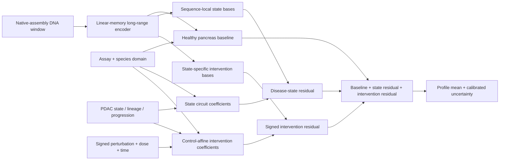

## 1. Executive decision

The standalone project is real and substantial: its data tree is now 165,576,540,072 bytes
(154.205 GiB across 51,349 files) after the
complete, hash-verified GSE99311 archive was safely extracted, in addition to a short-range
enhancer model, promoter and guide models, circuit simulation, and trained result artifacts. It
does **not** currently beat Enformer; no official candidate, Enformer, adapter, or
Borzoi claim bundle exists yet. Of the 94.854 GiB ENCODE
bulk collection, all 54 locally indexed ChIP BAMs are healthy pancreas or endocrine pancreas;
there are zero PDAC tumor BAMs.

That is not wasted data. It becomes the healthy counterfactual in a stronger scientific design:

> Learn a long-range sequence/assay prior for healthy pancreas, then learn a signed PDAC-state
> residual and a perturbation residual. Test whether this decomposition predicts unseen PDAC
> donors, subtype transitions, progression, and perturbation direction better than a frozen
> Enformer baseline.

The implementation is named **PDACircuitFormer**. The name refers to chromatin-state circuits,
not a claim that a neural network has inferred biological causality.

## 2. The falsifiable headline claim

The only admissible headline is:

> On a frozen, post-registration benchmark, PDACircuitFormer improves over official frozen
> Enformer predictions on held-out PDAC regulatory profiles, PDAC-minus-normal residuals,
> classical-versus-basal contrasts, within-study unseen-locus perturbation direction, a
> target-sealed external KLF5-degradation experiment, and untouched external patient studies;
> each improvement is positive under a paired bootstrap over independent biological groups,
> and 90% conformal prediction intervals calibrate on held-out groups.

The project must emit **ABSTAIN**, not “beats Enformer,” if any required axis fails. A win on
healthy pancreas, a chromosome-only split, a window-level p-value, or one convenient assay is
insufficient.

Raw Enformer receives identical DNA in control and treated states and therefore has a structural
zero perturbation residual. A perturbation win against that baseline is meaningful but too easy to
support a novel conditioning claim. The official verdict therefore also requires a separately
frozen **Enformer + grouped PDAC state adapter** to pass every axis with byte-identical candidate
bundles. Borzoi is a mandatory reported modern secondary comparator. Neither comparator may be
relabeled as official Enformer.

## 3. Why the old 2 kb model cannot answer the question

The current enhancer CNN uses 2,000 bp windows and approximately 1.6 million parameters. It is
useful for local part scoring, but it cannot directly represent distal enhancer-promoter
relationships across tens or hundreds of kilobases. Enformer consumes 196,608 bp and predicts
128 bp bins; its core contribution was long-range information flow. A fair challenge therefore
needs Enformer-length context, identical genomic examples, explicit track mapping, and frozen
baseline predictions.

The old enhancer result (AUROC 0.815 on held-out chromosomes) remains a local ablation. It must
not be compared directly with an Enformer track score produced on different examples or with a
different target transformation.

## 4. Scientific hypotheses

### H1 — disease residual compressibility

PDAC chromatin is not an unrelated regulatory system. A large fraction should be expressible as
a healthy pancreas sequence prior plus a lower-dimensional disease residual. This predicts that
explicit residual learning will improve donor transfer and require fewer parameters than
learning every PDAC track independently.

### H2 — subtype topology is a state graph, not two unrelated labels

Classical and basal-like PDAC share a malignant backbone but diverge along lineage programmes
including GATA6/HNF4A and TP63/AP-1/TEAD-associated regulation. Encoding healthy, PanIN,
primary, metastatic, classical, basal-like, treated, and resistant states in a graph should
improve data efficiency while allowing the classical/basal branch to remain distinct.

### H3 — perturbations act on the disease residual

KRAS/MAPK, GATA6, HNF4A, TP63, AP-1, TEAD/YAP, SMAD/TGFβ, MYC, TET, KDM6A, ARID1A/SWI-SNF,
BRD4, KLF5, and ELF3 perturbations should change only a structured subset of the PDAC residual. Predicting
the sign and genomic distribution of those changes is more mechanistically informative than
predicting absolute signal alone.

### H4 — the healthy counterfactual improves safety reasoning

The 95 GiB normal-pancreas atlas provides a direct penalty against interventions predicted to
collapse regulatory programmes already active in healthy pancreas. This is a research safety
margin, not a toxicity prediction.

### H5 — specialized linear-memory context can beat generic quadratic attention in-domain

At 128 bp resolution, PDACircuitFormer alternates dilated gated convolutions with landmark
cross-attention. Its global cost is O(NM), where N is the number of genomic bins and M is a small
set of dual-statistic regional landmarks. Each region contributes one mean-context token and one
parameter-free, content-routed salience token, so narrow regulatory peaks are not represented only
by a diluted average. The hypothesis is not that this is universally better than attention; it is
that PDAC-state conditioning and a specialized peak-aware inductive bias can win on PDAC tasks
with substantially less memory. This remains an unproven architectural hypothesis until the
registered controls and independent tests are complete.

### H6 — species-calibrated baseline, species-invariant disease circuit

The progression studies contain native mouse data, while the decisive external benchmark is
human; GSE99311 contains 124 mouse and 12 human metadata samples, but its 60 usable continuous
profiles are all mm9. The only two nominally human continuous profiles have exact hg18 chromosome
sizes despite depositor hg19 labels and are excluded rather than relabeled. The frozen adaptation
contract adds GSE149103 and the GSE272459/GSE272461/GSE272462/GSE272586 training planes, while
GSE272463 is patient-study validation only. GSE124229/GSE124230 remain sealed patient tests, while
GSE301272/GSE301284/GSE295354 are sealed external KLF5 perturbation tests. The model gives
human/mouse domain indicators access to baseline calibration, but penalizes any change in the
causal PDAC circuit coefficients when only the species label is counterfactually flipped. Mouse
profiles are always paired with their depositor-declared assembly sequence (mm9 here), and human
profiles with hg19 here; later mm10/hg38 studies retain their own native builds.

### H7 — counterfactual algebra should be an inductive bias, not a learned convention

The intervention branch is constrained to return exactly zero for a zero perturbation vector and
to reverse sign under a signed intervention flip. State and intervention residuals remain
separate from the healthy sequence prior. These algebraic constraints reduce the number of ways
the network can fit a perturbation while violating the intended counterfactual meaning. The
matched direct CNN controls receive the same conditioning and nearly identical parameter count,
so any gain must survive a test against capacity without this circuit factorization.

### H8 — evidence topology matters as much as model topology

Internal unseen-locus transfer, an external KLF5 degradation program, and untouched human patient
profiles answer different questions and are never pooled into one inflated sample count.
Technical replicates, assays, time points, and shared-control interventions are nested within
their biological context. Latent factors can receive biological names only after the predictive
gates pass and their subspace is stable across all three seeds under rotation-invariant CKA.

## 5. Model definition

For sequence window `x`, assay descriptor `a`, species domain `d`, PDAC state descriptor `s`,
and signed perturbation descriptor `p`, the model predicts:

```text
z                 = EfficientLongRangeEncoder(x)
b(x, a, d)        = species-calibrated healthy sequence/assay baseline
q_state(x,a,d)    = sequence-local regulatory factor bases
c_state(a,s,d)    = PDAC circuit coefficients
r_state           = sum_k c_state[k] * q_state[k]
q_int(x,a,s,d)    = state-specific intervention factor bases
u_j(x,a,s,d,|p|)  = magnitude-conditioned potential for signed intervention axis j
c_int             = sum_j p_j * u_j / sqrt(max(1, sum_j |p_j|))
r_int             = sum_k c_int[k] * q_int[k]
mu(x, a, s, p)    = softplus(b_raw + r_state + r_int)
sigma²             = heteroscedastic uncertainty head
c_state, c_int     = separate state-circuit and intervention factors
```

The conceptual separation is the core hypothesis:



This is deliberately stronger than a generic condition embedding. Healthy masks delete the state
branch exactly; zero perturbations delete the intervention branch exactly; sign reversal is an
exact algebraic symmetry; and each non-baseline term has a matched biological contrast that can
falsify it. The intended novelty is the conjunction of those invariances with long-range,
peak-aware routing and a protected PDAC perturbation test—not parameter count alone.

For healthy-pancreas examples, the disease mask sets `r_state = 0` exactly. A zero perturbation
vector sets `r_int = 0` and `c_int = 0` exactly, despite neural-head biases. Reversing every
registered mechanistic sign while retaining dose, time, and confidence magnitudes makes
`c_int(-p) = -c_int(p)` and `r_int(-p) = -r_int(p)` exactly. This makes all three terms
functionally separable under the registered masks and matched contrasts. It does not make an
individual latent coordinate identifiable: factor bases and coefficients can still rotate or
permute together without changing a prediction. Paired PDAC/normal changes directly supervise `r_state`;
paired intervention/control changes supervise `r_int`. This avoids the common failure in which a
model predicts absolute high-signal regions well but fails to predict disease- or
intervention-specific changes.

### 5.1 Sequence stem

- A/C/G/T one-hot input; N is all zero.
- Seven progressive stride-two convolution blocks for 128 bp bins.
- Early channels remain small, so the model never creates a 192- or 512-channel tensor at full
  196 kb base resolution.
- Group normalization avoids unstable batch statistics at microbatch size one.

### 5.2 Long-range trunk

- Gated depthwise convolutions with dilations 1, 2, 4, 8, 16, 32 (and 64 at scale).
- Two landmark cross-attention exchanges. Queries retain every bin; keys and values interleave a
  regional mean token with a differentiable salience-routed token. Routing uses standardized
  channel energy inside each fixed region and adds no trainable parameters. The number of tokens
  remains fixed, so global memory and compute remain O(NM).
- Cross-attention receives an explicit parameter-free relative genomic bias. Heads span context
  preferences from one landmark region to the whole window, with paired upstream, neutral, and
  downstream bases. Equal query/landmark shifts preserve the bias exactly, so long-range content
  is no longer position-agnostic and 196 kb/524 kb profiles share one normalized geometry.
- The registered mean-only control duplicates each regional average, preserving the same token
  count, attention tensor shapes, 2,248,306 parameters, training data, and optimizer schedule. It
  trains independently for all three seeds; it cannot inherit dual-statistic weights. This is the
  attribution test for whether salience routing itself helps.
- Gradient checkpointing on every trunk and mixing block.
- Reverse-complement ensembling at evaluation.

### 5.3 Continuous conditioning

The model does not allocate a separate output head per cell or track. It uses continuous assay,
state, and perturbation vectors frozen in `chromatin_registry.json`. This enables combinations
not seen during training and makes state similarity explicit.

Assay features cover accessibility, active and repressive histone marks, TF/CTCF occupancy,
stranded RNA, initiation assays, methylation, and replicate quality. State features cover
healthy pancreas, PanIN, primary/metastatic PDAC, classical/basal-like lineage, treatment,
resistance, model system, compartment fractions, KRAS activity, and confidence. Perturbation
features cover the major candidate regulatory axes plus dose, time, and evidence confidence.
FOXA1, GATA5, TP53, CDKN2A/RB, KLF5, and ELF3 are explicit signed axes: positive means
activation/overexpression and negative means repression/knockdown/knockout. Non-targeting
controls are exactly zero. The final
two state entries are mutually exclusive human/mouse domain indicators.

### 5.4 Circuit bottleneck

Separate state and intervention circuit heads produce low-dimensional vectors per window. The
intervention head emits one potential vector for each of the 19 registered signed axes, conditioned
on sequence, state, assay, and all 22 absolute perturbation-context values. Signed coordinates
then combine those potentials through a control-affine operator. These vectors are the only
coefficients that can combine sequence-local regulatory bases into a
disease or intervention residual; ablating the coefficient head forces that residual to zero. The
intervention vector is structurally zero for unperturbed examples, preventing ordinary disease
state from being relabeled as an intervention. Neither vector is automatically assigned to named
TFs. Named interpretations require all of the following:

Both coefficient heads are zero-initialized, so optimization starts exactly at the healthy
sequence/assay baseline and must learn every disease or intervention deviation from evidence.

1. stability across seeds;
2. association with the same factor's occupancy or perturbation data;
3. correct intervention direction on a held-out experiment;
4. no equivalent association in matched null factors; and
5. attribution localized to plausible regulatory sequence.

Until then, these are latent factors, not discovered pathways.

### 5.5 Rotation-invariant circuit interpretation gate

Predictive accuracy and biological interpretation are separate claims. After all three registered
seeds are trained, `chromatin-circuit-audit` compares their latent representations on exactly the
same label-free examples. It uses centered linear CKA, which is invariant to orthogonal rotation
and reflection, rather than matching coordinate 7 from one seed to coordinate 7 from another.
The frozen gate requires minimum pairwise CKA 0.40, median pairwise CKA 0.60, effective rank at
least 4.0 in every seed, and no seed with more than 75% of latent variance in one singular
direction. A failed gate emits `ABSTAIN` for circuit interpretation even if profile prediction is
strong. Named TF/pathway language still additionally requires matched occupancy or perturbation
evidence, held-out intervention direction, null-factor specificity, and plausible sequence-local
attribution.

## 6. Loss and training objective

The total loss is a weighted sum of:

```text
L = L_multiscale_log_profile
  + 0.25 L_within_window_correlation
  + 0.10 L_heteroscedastic
  + 0.50 L_paired_PDAC_minus_normal
  + 0.50 L_paired_intervention_minus_control
  + 0.10 L_healthy_residual_zero
  + 0.05 L_state_graph
  + 0.05 L_species_counterfactual_invariance
```

The state graph is evaluated counterfactually at every locus by replacing only the four frozen
progression indicators (normal, PanIN, primary, metastatic), so it remains active at micro-batch
size one. A second-difference penalty smooths implausible trajectory kinks without requiring all
adjacent transitions to be small. The species loss flips only the human/mouse indicators and
requires the circuit coefficients—not the calibrated baseline—to remain invariant.

The profile loss is evaluated at 128, 256, 512, and 1,024 bp scales. This prevents the model
from winning only by smoothing or only by fitting sharp peaks. The exact weights are defaults,
not evidence; they must be tuned on validation donors and then frozen. Every weight is a strict
field in `ChromatinTrainConfig`, is included in the checkpoint configuration hash, and therefore
cannot be changed silently during resume or inference. Intentional loss ablations use separate
configs and retain the SHA-256 lineage of the common weight-only parent checkpoint.

The intervention operator enforces exact control-nullness and global signed antisymmetry
structurally, so optimization cannot trade those properties away. Held-out evaluation still tests
direction accuracy at preregistered regulatory loci. Dose monotonicity is not imposed globally:
absolute dose and time may change each axis potential, allowing saturation, rebound, and biphasic
responses when supported by paired data.

## 7. Data planes

### Plane A — existing 101 GiB local corpus

| corpus | size | role |
|---|---:|---|
| ENCODE healthy/endocrine pancreas | 94.854 GiB | healthy counterfactual and multi-assay pretraining |
| hg38 FASTA | 3.965 GiB on disk including compressed/uncompressed/index | coordinate sequence source |
| mm10 FASTA | 3.515 GiB compressed/uncompressed/index, MD5 and SHA-256 verified | native mouse sequence source |
| mm9 and hg19 FASTAs | checksum-pinned UCSC native assemblies | GSE99275/GSE99311 sequence sources |
| dbSNP common | 1.483 GiB | common-variant exclusion/annotation, not outcome truth |
| FANTOM5 CAGE | 0.792 GiB | initiation pretraining |
| pancreas ATAC/H3K27ac peaks | 0.025 GiB | local enhancer baseline |
| TCGA-PAAD, GTEx, drivers, TF lists | small | state descriptors and downstream context |
| DepMap CRISPR pointer | 0.410 GiB hashed in sibling project | functional dependency validation |

The bulk ENCODE mix contains 155 histone ChIP, 39 DNase, 16 ATAC, 88 RNA, 20 TF
ChIP, 8 RAMPAGE, and 4 WGBS files. Every downloaded artifact is hash-recorded.
The frozen canonical selection resolves all 276 bigWigs across 75 biological experiment groups,
retains 148 tracks across 66 groups, and records explicit exclusion reasons for the other 128.
The complete compiled healthy prior has 2,118,031 source- and shard-hash-verified examples in
33,156 shards. Its materialized audit is GREEN: 1,685,689 train, 236,288 validation, and 196,054
locus-test examples with zero interval or group leakage.

### Plane B — open PDAC chromatin and expression programme

The complete pointer registry is `pdac_chromatin_assets.json`. Priority order:

1. **GSE99275 + GSE99311** — progression/metastasis organoid ATAC, H3K27ac, RNA, and exact
   vector-family intervention pairs; use for the early curriculum and hold out entire lines.
2. **GSE149103** — 36 eligible hg19 accessibility, histone, and CTCF profiles spanning HPNE,
   primary PANC1, and metastatic Capan1 cell lines; use only as globally grouped cell-line
   training, never as an independent patient cohort.
3. **GSE272459/GSE272461/GSE272462/GSE272586** — 16 engineered human-organoid ATAC profiles,
   nine AP-1/histone CUT&RUN profiles, eight methylation profiles, and four non-input early-lineage
   occupancy profiles. These provide driver, ERK/AP-1, lineage-loss, and cross-layer training.
4. **GSE272463** — 14 primary patient-PDAC ATAC profiles; every window is forced to `validation`,
   survival fields are redacted from derived metadata, and the study never enters gradient updates.
5. **GSE64557 + GSE272460** — registered KLF5/ELF3 peak and ERK/AP-1 RNA auxiliary studies,
   excluded from profile training until their BED/RNA transforms are frozen.
6. **GSE195623** — patient-derived PDAC organoid accessibility with drug sensitivity; use as a
   state/drug holdout.
7. **GSE124229 + GSE124230** — 54 primary EpCAM-positive treatment-naive PDAC specimens with
   accessibility and matched expression; keep the whole study untouched for the principal
   human external test.
8. **GSE243528** — methylation/chromatin cross-layer test.
9. **GSE301272 + GSE301284** — L36pl KLF5-dTAG ATAC/H3K27ac time course. The two assays are
   nested inside one biological context and are never counted as two independent groups.
10. **GSE295354** — an independent-lab KLF5 lineage programme contributing exactly AsPC1 and
    T3M4 contexts. Together, the three target-sealed archives are 43.474 GiB.
11. **GSE138452 + GSE47535** — HNF4A and GATA6 lineage-mechanism tests. **GSE146486 is explicitly
    excluded from every PDAC claim** because it is hESC pancreatic-endocrine differentiation with
    TET knockout, not pancreatic ductal adenocarcinoma.
12. **GSE202051** — independent single-nucleus/spatial expression state descriptors.
13. **Open pancreatic organoid WGS/WXS/RNA on AWS/GDC** — genotype-expression and variant tests.

### Plane C — gated assets

HUM0257.v2 and HRA010277 are recorded as gated. Their ATAC/ChIP/Hi-C/RNA data are valuable for
3D and cross-study validation, but the pipeline must not bypass authorization or invent hashes.

### Plane D — missing decisive evidence

The strongest future test would be paired sequence, chromatin, and transcriptome before/after a
regulatory perturbation in PDAC organoids, with multiple donors and a normal-ductal comparator.
Public data may cover pieces of this design, but the project must report the missing cell rather
than simulate it.

### Frozen claim-surface topology

`configs/chromatin-claim-surfaces.json` is now a hash-bound execution contract rather than a prose
wish list:

| required axis | biological source | independent unit | key leakage barrier |
|---|---|---|---|
| held-out locus profile | open healthy/progression/human studies | donor, global cell line, or organoid line | chr8/chr9 never tune |
| joint PDAC locus/state | open multi-study adaptation | held-out biological group | group and chromosome both unseen |
| PDAC-minus-normal residual | GSE99275/GSE99311/GSE149103 | valid biological contrast | no fabricated pairs |
| classical/basal contrast | GSE149103/GSE138452/GSE47535 | globally deduplicated cell line | cross-study line aliases collapse |
| within-study perturbation | GSE99311 | exactly KPC-2D, M1L, T3, and T23 contexts | H3K27ac primary; replicates/shared controls nested; unseen loci only |
| external KLF5 perturbation | GSE301272/GSE301284/GSE295354 | exactly three cell-line/program contexts | all target signals sealed; replicates/assays/time nested |
| untouched human study | GSE124229/GSE124230 | patient | metadata and target profiles sealed |

For the external KLF5 axis, the primary contrast is fixed at 4 h dTAG minus matched 0 h. The L36pl
ATAC and H3K27ac assays contribute one context; AsPC1 and T3M4 contribute the other two. Zero-hour
KLF5 occupancy may select loci, but treated-minus-control magnitude or direction may not. One-hour
onset, 24-hour durability, H3K4me3 specificity, and matched non-bound loci are diagnostics, not
extra bootstrap groups. Any unexpected group label is a hard error.

## 8. Bounded-memory data compiler

`chromatin-compile` processes one bigWig at a time. It stores:

- chromosome/start/end;
- stable example ID, accession, study, and independent sample group;
- a float16 target profile and valid-bin mask;
- fixed assay/state/perturbation vectors; and
- a disease mask.

Sequence is not stored in shards. It is fetched lazily from the matching `.fai`-indexed hg38,
hg19, mm10, or mm9 FASTA. Every TrackSpec carries both organism and reference genome; the compiler checks the
FASTA assembly signature and bigWig chr1 length before reading a training window.
Default shards contain 64 windows; one shard is resident per worker. Empty windows are retained
with a deterministic 5% probability to control class imbalance without allowing the model to
see only positive regions.

The compiler writes a per-track manifest containing the source SHA-256, preprocessing settings,
bigWig backend, window counts, and shard sizes. It uses pyBigWig on Linux/macOS and pybigtools on
Windows behind the same streaming contract. Resuming or reprocessing one track does not
invalidate others.

Conditioning dimensions are checked from every per-track manifest before a DAG is declared
runnable and again from every shard during streaming. A legacy perturbation vector may be padded
to the current 22 axes only when the entire vector is exactly zero; zero has no coordinate
semantics to remap. This preserves the already verified healthy and GSE99275 corpora without
rewriting 3.5 GB of profiles solely to add zeros. Any nonzero legacy vector fails closed, so the
GSE99311 intervention corpus must be decoded and compiled natively under the current registry.

Every compiled example also receives its frozen split label. Train-state tracks map chr6/chr7 to
validation, chr8/chr9 to locus test, and all remaining canonical chromosomes to train. A whole
held-out donor maps chr8/chr9 to joint locus-state test and its other loci to state test; external
and temporal roles override chromosome. `chromatin-train` has no test-split override and consumes
only examples labeled `train`; it fails if none remain.

The separate `validation_study` role overrides chromosome by assigning every window to
`validation`. This is how GSE272463 can select `best.pt` without contributing a single gradient
update. The multi-study campaign repeats `--shards` for every frozen collection, hashes the exact
union, and becomes non-runnable if any registered collection or completion marker is missing.

`chromatin-freeze-profile-truth` exports a named evaluation split with exact example IDs,
independent groups, targets, and per-bin validity masks. Uncovered bins remain masked throughout
assembly, metrics, and uncertainty checks; they are never scored as biological zero. The frozen
truth file is hashed into every prediction provenance manifest.

Registered GEO studies use a separate two-step path. `chromatin-study-plan` resolves the NCBI
supplementary listing, records its hash and file sizes, but downloads no payloads.
`chromatin-fetch-study` then downloads sequentially with `.part` resume, a total-byte safety cap,
and per-file SHA-256. Any registered test or holdout study is forced into an isolated `protected`
directory and cannot be fetched without an explicit guard override; this is a data-isolation
control, not permission to use its labels for selection.

Downloaded RAW tar files are handled by `chromatin-inspect-geo-archive` and
`chromatin-extract-geo-archive`. Both reject traversal paths, links, devices, and unexpected member
types; extraction is atomic, size-capped, and SHA-256 manifested. The inventory recognizes assay
and sample-label tokens but leaves every biological state unresolved until registered sample
metadata is reviewed—tokens such as N/P/T/M are never guessed into normal/primary/metastatic labels.

`chromatin-geo-metadata` caches and hashes the authoritative family SOFT record and routes each
accession through an explicit reviewed decoder. Biological state and driver/treatment direction
come from depositor characteristics; titles are allowed only for strict sample identity, replicate,
or assay/target joins. Unknown values fail closed. For GSE272463, `status`, `os`, and `dfs` are
removed from derived metadata and never enter TrackSpecs or checkpoint selection.
`chromatin-geo-track-specs` joins extracted `.bw`/`.bigWig` files through the depositor-declared
supplementary filename, assigns the native genome, and records excluded input/unsupported outputs.
All 10 GSE99275 samples and all 136 GSE99311 metadata records resolve without fallback inference;
GSE99311 yields 60 validated mm9 continuous profiles, while two nominal hg19 H3K27ac bigWigs are
explicitly excluded because their chromosome sizes are exact hg18. The complete RAW archive is
17,017,630,720 bytes with SHA-256
`62dc05c5e696c8076fd3cee0603b0d8a9e7ed0436e359d012b895b944ab7866c`. The extraction manifest is
SHA-256 `cce03d737af29e05b9df5b7f4ce055da5c90e483174cb638472d6a3777df2464`;
the reviewed new decoders resolve all 215 records across the eight newly registered studies, of
which 87 are eligible profile tracks and 128 are explicitly excluded or auxiliary.

Biological pairs are never inferred from filenames. `chromatin-intervention-pair-plan` requires
one depositor-labeled control and intervention in the same exact study, line, assay, replicate,
genome, and control-technology family. Unperturbed, MSCV-empty, miR-E/shRen, and sgRosa samples
are not interchangeable controls. The realized GSE99311 archive resolves 13 profile contrasts
with zero unresolved groups: 10 H3K27ac primary contrasts and three FOXA1 occupancy diagnostics.
They are nested into exactly four independent biological contexts (KPC-2D, M1L, T3, and T23), not
13 pseudoreplicate groups. The GSE99275 progression lines remain unpaired because
shared coordinates do not make independent organoids paired biological samples. After an explicit
normal/disease or control/intervention registration, `chromatin-pair` performs a coordinate-sorted merge while
holding only one source shard in memory. State mode adds `paired_delta` and `pair_mask`;
perturbation mode adds `perturbation_delta` and `perturbation_mask`. Inputs and outputs are hashed,
the overlap fraction must pass a fail-closed threshold, and unmatched loci are reported.
`chromatin-materialize-intervention-pairs` executes every registered intervention pair, verifies
all source and output shard hashes, and writes an atomic pair-plan-bound completion marker. The
signed-intervention trainer rejects ordinary raw shards, partial pair selections, or collections
without `perturbation_delta` and `perturbation_mask`. RNA RPKM tables are retained as a separate
auxiliary endpoint; they are not mislabeled as genomic chromatin profiles.

## 9. Split constitution

The split is nested because chromosome-only performance is not enough:

| surface | unseen component | purpose |
|---|---|---|
| validation | chr6/chr7 | model selection only |
| locus test | chr8/chr9 | new DNA loci in seen biological states |
| state test | complete held-out donors/tracks | new PDAC biological units at seen loci |
| joint locus-state test | chr8/chr9 in held-out donors | primary generalization surface |
| external-study test | entire registered GEO/archive study | protocol, lab, and cohort shift |
| temporal test | released after 2026-06-20 | post-registration evidence |

Adjacent or overlapping windows cannot cross the chromosome split. Sample groups are donor or
biological replicate—not individual windows or technical replicates. Hyperparameter tuning may
never use state, joint, external, or temporal test outcomes.

## 10. Enformer and Borzoi comparison modes

### Mode A — frozen zero-shot profile

Map each assay to a preregistered, biologically defensible Enformer/Borzoi output. Freeze the
mapping before examining PDAC labels. This tests immediately available models but can be limited
when no PDAC-specific output head exists.

The frozen human pancreas target map is explicitly tied to Enformer's human head and rejects
mm9/mm10 windows. A separate frozen mouse map supports the realized GSE99311 perturbation surface
without pretending that a human output head applies to mm9. Its official source table uses global
indices 5,313–6,955, so the resolver subtracts the frozen 5,313 mouse-head offset before indexing
the 1,643-channel Enformer tensor and retains both indices in provenance.

`enformer_target_policy.json` implements that freeze from target descriptions alone. It averages
all matching pancreas targets for accessibility, five registered histone marks, CTCF, or adult
pancreas CAGE; it never selects the best-performing head. Bulk RNA and WGBS are explicitly
unsupported for zero-shot Enformer rather than being mapped to another modality. The resolver
writes the target-table hash, policy hash, exact indices, accessions, and descriptions.

`enformer_mouse_target_policy.json` freezes all 107 official mouse H3K27ac outputs by description
alone and averages them without looking at PDAC outcomes. The official table has no pancreas
H3K27ac or FOXA1 output. The mean is therefore reported honestly as a generic mouse H3K27ac
sequence prior; FOXA1 occupancy is diagnostic only and cannot enter the Enformer headline score.
The 12 mouse pancreas CAGE channels are retained as a separately named diagnostic, not substituted
for chromatin.

`borzoi_target_policy.json` independently freezes nine human pancreas mappings from the official
Borzoi table: accessibility, six ChIP targets, adult CAGE, and RNA. The frozen map retains all
7,611 strand-pair indices needed by the official reverse-complement transform and the exact
inverse-transform fields for every selected output. The exporter requires all four official
replicates, loads one at a time to bound RAM, undoes clipping/square-root/scaling transforms,
averages targets and replicates, pools 32 bp to 128 bp, and takes the symmetric central 896 bins.

Every profile comparison uses the same central 896 × 128 bp bins (114,688 bp). The candidate is
center-cropped; Enformer uses its complete native 896-bin output; Borzoi is averaged from 32 bp to
128 bp and center-cropped. Baselines retain their native input context. For PDAC-minus-normal
state residuals, a sequence-only baseline predicts exactly zero; signed negative asinh-MAE is used
because rank correlation with a constant zero vector is mathematically undefined.

The official TensorFlow-Hub exporter is isolated in `baseline_runners/enformer_export.py` with a
Python 3.10/TensorFlow 2.15 environment, because the main training environment is Python 3.12 and
PyTorch. It reads only preregistered coordinates and sequence—never truth labels—averages the
frozen target indices, hashes the dedicated model cache, and writes raw predictions. The exact
official handle is frozen in `baseline_assets/enformer-model.json`; the runner has no model-URL
override and refuses inference until `fetch_enformer_assets.py` has materialized the dedicated
cache and frozen its complete tree SHA-256, file count, and byte count. The same exporter selects
only the assembly-compatible official `human` or `mouse` tensor and validates two chromosome-size
signatures before reading sequence. For state,
subtype, and intervention contrasts, `chromatin-zero-baseline` emits Enformer's mathematically
honest zero contrast. `chromatin-assemble-bundle` requires the prediction and truth ID sets to be
exactly equal, rejecting selective omissions, then writes both the bundle and its provenance.
The official Borzoi path is likewise isolated in `baseline_runners/borzoi_export.py` and
`environments/borzoi-baseline.yml`. Its resumable asset materializer downloads sequentially and
freezes each SHA-256; model weights are never loaded together.

### Mode B — grouped condition-aware Enformer adapter

The required strong diagnostic comparator is an identity-initialized 24,769-parameter dilated
profile adapter. Assembly-specific human and mouse checkpoints use the same architecture but
separate frozen target identities. Each sees only frozen Enformer predictions and the
preregistered condition vector; candidate embeddings, candidate predictions, test labels, and
test-group tuning are forbidden. For an intervention comparison, the exporter emits both the
registered treatment condition and a provenance-recorded exact-zero perturbation reference, then
subtracts reference from treatment before truth is joined. This tests whether a cheap
condition-aware calibration of Enformer explains the apparent gain.

### Mode C — representation-controlled adapter

Freeze each sequence encoder and give Enformer, Borzoi, and PDACircuitFormer an adapter with the
same parameter budget and PDAC training data. This asks whether the learned sequence
representation is better, separate from output-head availability.

### Mode D — from-scratch matched-data ablation

Train the registered direct conditional CNN at both 2 kb and 196 kb, plus PDACircuitFormer, on
identical tracks and splits. Both direct CNNs contain exactly 2,259,947 learned parameters; the
local model exhaustively tiles each 196,608 bp source window into 96 non-overlapping 2 kb contexts
and reconstructs the original example ID and 1,536-bin profile before the common 896-bin crop.
The 196 kb direct CNN has no landmark attention or causal residual branches and is within 0.518%
of the 2,248,306-parameter local PDACircuitFormer. The legacy enhancer classifier remains a
secondary classification result, not a substitute for this profile-matched control. Its 16-tile
microbatch and 384-step accumulation cover 6,144 local tiles, or exactly 98,304 target bins per
optimizer step—the same bin mass as 64 accumulated 1,536-bin long windows. Together
these runs identify gains from context, global mixing, residualization, and capacity.

No baseline prediction enters candidate training as a pseudo-label. Distillation would be a
separate experiment and cannot support the primary claim.

## 11. Frozen “beats Enformer” gate

The registry currently requires:

| axis | metric | minimum paired improvement |
|---|---|---:|
| held-out locus profile | Pearson | +0.03 |
| joint PDAC locus/state profile | Spearman | +0.05 |
| PDAC-minus-normal residual | negative signed-asinh MAE | +0.05 |
| classical/basal contrast | average precision | +0.03 |
| perturbation direction | sign accuracy | +0.05 |
| untouched external study | Spearman | +0.03 |

Each delta is computed per independent biological group, then bootstrapped over groups. The 95%
paired confidence interval must remain above zero. Minimum group counts are encoded per axis.
Window-level resampling is forbidden because genomic bins and windows are correlated.
Candidate and baseline bundles must contain exactly the same example IDs, truth values, masks,
split labels, and independent-group labels; any geometry mismatch aborts the comparison.

The official candidate is not a selected seed. `chromatin-ensemble-seeds` requires raw predictions
from exactly seeds 20260620, 20260714, and 20260808 on the identical label-free cohort, verifies
their checkpoint and raw-file hashes, reorders only by exact example ID, and takes the arithmetic
mean before conformal calibration. The claim runner also reloads the separately assembled bundle
for every seed. The ensemble must pass every registered margin and paired confidence interval,
while every individual seed must have a strictly positive delta on every required axis. One lucky
seed, a missing seed, duplicate seed labels, or one regressive seed forces `ABSTAIN`.

Additionally:

- 90% split-conformal coverage must be within its binomial tolerance on held-out groups;
- interval sharpness is reported, never optimized on the test set;
- reverse-complement disagreement is reported;
- performance is stratified by assay, signal intensity, enhancer distance, subtype, and study;
- peak VRAM, wall time, energy proxy, and parameter count are reported; and
- results on accessions plausibly present in Enformer training are separated from truly later
  PDAC studies.

## 12. Baseline provenance firewall

`chromatin-benchmark` requires a SHA-locked provenance manifest for both models. The manifest
contains:

- model/version and weight SHA-256;
- candidate seed and raw-prediction SHA-256, or the exact ordered three-seed component hashes;
- prediction bundle SHA-256;
- track-mapping SHA-256;
- data-snapshot SHA-256;
- exact prediction command and timestamp; and
- whether the model is the candidate or predictions-only baseline.

Missing or mismatched provenance forces ABSTAIN. This prevents post-hoc head selection or
silent replacement of baseline outputs.

## 13. Compute profiles

| profile | context | bins | parameters | intended hardware |
|---|---:|---:|---:|---|
| local-12gb-slow | 196,608 bp | 1,536 | 2,248,306 | installed 12 GB GPU; microbatch 1, accumulation 64; require 10 GB free |
| scale-24gb | 196,608 bp | 1,536 | 6,770,418 | 24 GB GPU; require 20 GB free |
| scale-48gb | 196,608 bp | 1,536 | 20,265,986 | 48 GB GPU; main capacity run; require 44 GB free |
| scale-80gb extended | 524,288 bp | 4,096 | 32,916,162 | 80 GB GPU; Borzoi-length ablation; require 72 GB free |

Parameter-state memory is small; early convolution activations dominate. Gradient checkpointing,
mixed precision, one-example microbatches, accumulation, and coordinate-only shards are enabled
in every profile. Frozen command vectors bind profile-specific free-VRAM floors of 10, 20, 44,
and 72 GB for local, 24, 48, and 80 GB execution. An undersized GPU fails before model allocation;
`--device cpu` remains a much slower bounded-memory fallback. Manual low-VRAM override is
exploratory only and cannot silently redefine the frozen campaign.

All frozen profiles use zero data-loader subprocesses: one deterministic stream runs in the
training process. This is intentionally slower but makes the exact batch-in-epoch resume position
deterministic and minimizes RAM. The iterable still partitions shards defensively if workers are
enabled for an exploratory run, preventing duplicate examples, but such runs are not eligible for
the frozen benchmark unless their ordering is separately reproduced.

The current GPU remained at roughly 11.9/12.2 GiB and 100% utilization during this build, so no
scientific CUDA run was launched. A real 196,608 bp CPU forward pass produced a finite 1×1,536
profile, and the plumbing-only CPU profile completed one optimizer step without interrupting the
unrelated GPU workload.

`configs/chromatin-smoke-cpu.json` is a non-scientific plumbing profile: it performs exactly one
optimizer step on one real 196,608 bp example, writes a resumable checkpoint, and exits. Its
outputs must never enter a benchmark or biological interpretation.

## 14. Training curriculum

The executable promotion, multi-seed, hardware-safety, and ablation policy is frozen in
`configs/chromatin-campaign.json`. It defines three seeds, four hardware profiles, five curriculum
stages, and ten required ablations; test surfaces are never capacity-selection inputs.

### Stage 0 — freeze evidence and splits

- Hash registry, asset registry, track descriptors, and split policy.
- Bind `configs/chromatin-human-cohort.json` before any human adaptation run: six studies are
  training-eligible, GSE272463 is validation-only with outcome fields redacted, GSE124229 and
  GSE124230 remain sealed one-shot tests, and GSE64557/GSE272460 remain profile-training
  excluded until their BED/RNA transforms are separately frozen.
- Reserve GSE124229/GSE124230 and GSE301272/GSE301284/GSE295354 as target-sealed external data.
- Bind all seven axes to `configs/chromatin-claim-surfaces.json`; its SHA-256 is copied into every
  candidate and baseline provenance manifest.
- Audit donor/replicate identity and study overlap.
- Generate candidate and baseline track-mapping manifests before labels are inspected.

### Stage 1 — healthy multi-assay prior

- Train `b(x,a)` on the existing healthy pancreas ATAC/DNase/ChIP/RNA/RAMPAGE/WGBS tracks.
- Balance assays and biological replicates, not file count.
- Evaluate chr6/chr7 only during tuning.
- Compare with the local 2 kb CNN to establish the value of long context.
- The complete healthy prior contains 148 canonical tracks, 2,118,031 examples, and 33,156
  verified shards. Its materialized split audit has zero group or interval leakage.

### Stage 2 — PDAC progression residual

- Add GSE99275/GSE99311 and related open organoid data.
- Initialize `r_state=0`; learn the progression residual from absolute state profiles and the
  registered counterfactual graph. Apply a paired state-delta loss only where a depositor-authored
  matched lineage exists; GSE99275 organoid lines are not fabricated into pairs.
- Hold out whole organoid lines and progression branches.
- Test whether circuit factors order normal → PanIN → primary → metastatic states without using outcome
  labels in the encoder.

### Stage 3 — signed intervention residual

- Freeze the healthy and state branches except the uncertainty head.
- Fit `r_int` only on exact registered control/intervention pairs; unperturbed intervention
  output remains structurally zero.
- Require the complete pair-plan materialization, including all vector-family-matched pairs and
  per-bin perturbation deltas; raw GSE99311 shards fail the stage-supervision gate.
- Test GSE99311 direction on unseen loci and label it honestly as within-study transfer. Unseen
  experiment direction is a separate post-freeze external axis.

### Stage 4 — human PDAC state adaptation

- Jointly adapt on the exact profile collections GSE99311, GSE149103, GSE272459, GSE272461,
  GSE272462, and GSE272586; every source must have a completion marker and the trainer hashes the
  deduplicated union of resolved shards.
- Evaluate checkpoint quality on GSE272463 patient accessibility without gradients and without
  exposing deposited status, overall-survival, or disease-free-survival fields. This cohort may
  select weights by chromatin-profile loss, but may not change architecture, endpoints, or claim
  thresholds.
- The executable human-stage DAG passes `--validation-study GSE272463`. The training stream
  excludes that accession, the selection stream includes only that accession, and either stream
  raises if any GSE272463 example has a non-`validation` split. Chromosome-validation groups from
  the six adaptation studies remain diagnostics and cannot select `best.pt`.
- Before model or optimizer allocation, a second audit requires GSE272463 to be present, verifies
  `validation_study` in every selected profile manifest, opens every patient shard to require exact
  `study=GSE272463` and `split=validation` arrays, and records the profile, shard, and example counts
  in the run report. Missing or malformed patient validation therefore fails before expensive work.
- The training objective remains multi-term, but `best.pt` and early stopping use only log-profile
  error, averaged within each GSE272463 patient group and then equally across groups. Correlation,
  uncertainty, paired-delta, progression-graph, and domain-invariance validation terms are retained
  in diagnostics but cannot select weights.
- Train continuous state descriptors and classical/basal contrast.
- Down-weight uncertain purity and mixed-compartment labels rather than pretending they are
  exact.
- Link regulatory influence to DepMap PDAC-line dependency as a validation endpoint, not a
  training shortcut.

### Stage 5 — freeze

- Freeze architecture, weights, preprocessing, condition vectors, baseline track mapping, and
  conformal calibration set.
- Export candidate and baseline prediction bundles with provenance manifests.

### Stage 6 — one-shot external evaluation

- Release and download the untouched GSE124229/GSE124230 patient studies and the target-sealed
  GSE301272/GSE301284/GSE295354 perturbation studies only after all three final checkpoints exist.
- Build evaluation-only TrackSpecs outside every training glob. Select exactly matched 0 h/4 h
  KLF5 pairs, require the frozen assay set and at least two matched replicates per assay, then keep
  all replicate/assay scores nested inside the three registered contexts.
- Run separate `chromatin-benchmark` reports for official Enformer, the grouped state adapter, and
  Borzoi, then compose them with `chromatin-benchmark-suite`.
- Publish `BEATS_ENFORMER_WITH_CONDITION_AWARE_ROBUSTNESS` or `ABSTAIN` exactly as emitted. No raw-
  Enformer-only claim is admissible.

## 15. Commands

Audit the current corpus:

```powershell
pdac chromatin-inventory --out results/chromatin_inventory.json
```

Inspect a model without allocating a full training batch:

```powershell
pdac chromatin-model-info --config configs/chromatin-local-12gb.json
```

Run a forward check on real chr1 sequence only when memory is available:

```powershell
pdac chromatin-model-info --config configs/chromatin-local-12gb.json --forward-check --device cuda
```

Materialize the checksum-pinned mouse reference, then resolve a training study without touching
protected holdouts:

```powershell
pdac chromatin-fetch-reference mm9
pdac chromatin-study-plan GSE99275
pdac chromatin-fetch-study --plan data/manifests/studies/GSE99275.plan.json
pdac chromatin-geo-metadata GSE99275
pdac chromatin-inspect-geo-archive --archive data/studies/training_candidate/GSE99275/GSE99275_RAW.tar
pdac chromatin-extract-geo-archive `
  --archive data/studies/training_candidate/GSE99275/GSE99275_RAW.tar `
  --output data/studies/training_candidate/GSE99275/extracted
pdac chromatin-geo-track-specs GSE99275 `
  --extracted data/studies/training_candidate/GSE99275/extracted
```

The external endpoints have a two-phase cryptographic release. Five accessions and their file
inventories were sealed before any protected target archive or local SOFT metadata existed:
GSE124229, GSE124230, GSE301272, GSE301284, and GSE295354.

```powershell
pdac chromatin-seal-protected-studies `
  --out results/frozen/protected-studies.seal.json
```

`--allow-protected-study` and `--allow-protected-metadata` are deliberately insufficient by
themselves. Protected target downloads and metadata both require the post-training release. The
release command requires the validation-selected final adaptation `best.pt` for all three
registered seeds, verifies stage/config/code/data/checkpoint hashes, and writes a separate release:

```powershell
pdac chromatin-authorize-protected-metadata `
  --checkpoint models/chromatin/campaign/chromatin-local-12gb/seed-20260620/04-human_state_adaptation/best.pt `
  --checkpoint models/chromatin/campaign/chromatin-local-12gb/seed-20260714/04-human_state_adaptation/best.pt `
  --checkpoint models/chromatin/campaign/chromatin-local-12gb/seed-20260808/04-human_state_adaptation/best.pt

pdac chromatin-geo-metadata GSE124229 --allow-protected-metadata `
  --protected-release results/frozen/protected-studies.release.json
```

No protected release exists yet, so the labels remain inaccessible while models and baselines are
still being built. A missing, duplicate, non-final, or drifted checkpoint keeps the seal closed.

After release, the external KLF5 path is isolated and fully bounded:

```powershell
pdac chromatin-fetch-study --plan data/manifests/studies/GSE301272.plan.json `
  --allow-protected-study `
  --protected-seal results/frozen/protected-studies.seal.json `
  --protected-release results/frozen/protected-studies.release.json
pdac chromatin-geo-track-specs GSE301272 `
  --extracted data/studies/protected/GSE301272/extracted `
  --evaluation-only `
  --protected-release results/frozen/protected-studies.release.json
pdac chromatin-external-perturbation-plan `
  --track-index data/evaluation_track_specs/GSE301272/index.json `
  --track-index data/evaluation_track_specs/GSE301284/index.json `
  --track-index data/evaluation_track_specs/GSE295354/index.json
```

The resulting merged index is evaluation-only. It is the exact input to the existing sequential
compiler and intervention-pair materializer; protected accessions are absent from every curriculum
glob.

Compile a bounded real-data smoke set first. The index runner is sequential, keeps only one shard
buffer in memory, refuses unverified pre-existing outputs, and records the SHA-256 of every shard:

```powershell
pdac chromatin-compile-index --config configs/chromatin-local-12gb.json `
  --track-index data/track_specs/GSE99275/index.json `
  --output data/processed/chromatin_gse99275_smoke_v1 `
  --max-tracks 1 --max-windows 200 `
  --windows-per-shard 32 --negative-keep-probability 1.0
```

After that manifest passes the independent verifier, compile all ten tracks with the same
memory bound. Keeping negative windows is deliberate here: cross-state coordinates must remain
available for honest matched-locus contrasts.

```powershell
pdac chromatin-compile-index --config configs/chromatin-local-12gb.json `
  --track-index data/track_specs/GSE99275/index.json `
  --output data/processed/chromatin_gse99275_full_v1 `
  --windows-per-shard 64 --negative-keep-probability 1.0

pdac chromatin-audit-compiled-splits `
  --shards "data/processed/chromatin_gse99275_full_v1/**/*.npz" `
  --out results/frozen/gse99275.split-audit.json
```

For GSE99311, freeze the exact vector-matched pair plan, compile all profile tracks with every
negative window retained, then materialize the only corpus accepted by the signed-intervention
stage:

```powershell
pdac chromatin-intervention-pair-plan `
  --track-index data/track_specs/GSE99311/index.json `
  --out data/pair_specs/GSE99311.intervention.json

pdac chromatin-compile-index --config configs/chromatin-local-12gb.json `
  --track-index data/track_specs/GSE99311/index.json `
  --output data/processed/chromatin_gse99311_full_v1 `
  --windows-per-shard 64 --negative-keep-probability 1.0

pdac chromatin-materialize-intervention-pairs `
  --pair-plan data/pair_specs/GSE99311.intervention.json `
  --compiled-root data/processed/chromatin_gse99311_full_v1 `
  --output data/processed/chromatin_gse99311_paired_v1 `
  --windows-per-shard 64 --minimum-overlap-fraction 0.995
```

The pair-plan command exits nonzero on any ambiguous control group. The materializer is resumable
only through already verified pair directories and refuses to overwrite a drifted partial result.
The complete post-download sequence is checked in as `scripts/complete_gse99311.ps1`. Download,
archive verification, safe extraction, authoritative metadata resolution, TrackSpec generation,
exact pair planning, bounded-memory compilation, and pair materialization are complete. The
verified paired collection contains 13/13 registered contrasts, 169,193 examples in 2,647 shards,
and a minimum observed coordinate-overlap fraction of 0.999306 against the frozen 0.995 floor.
Both collection builders retain atomic completion markers so a partial corpus can never be
declared runnable.

The full 780,203-example source and 169,193-example paired collections now have independent split
audits with zero train/held-locus interval overlap, zero held-state/development-group overlap, and
unique example IDs throughout. The uncapped primary chr8/chr9 surface contains 12,530 H3K27ac
examples over exactly KPC-2D, M1L, T3, and T23; its coordinate/condition manifest and signed truth
share exact example-ID SHA-256
`bcf13c825945089d91f9e3c41ddc0074ba1b992012bf9eadf09b5a88c19a2157`. Target-blind mouse
adapter selection is frozen separately: 12,288 train and 3,072 validation examples, each sampled
by SHA-256 rank over 12 biological-context/exact-condition strata, with zero ID overlap and no
target access during selection.

Build the bounded healthy prior and freeze the four hardware/three-seed run DAGs without
starting a GPU job. The frozen healthy-selection policy first resolves all 276 local ENCODE
bigWigs, then selects only canonical signal semantics for the 12-channel assay vector: p-value
rather than fold-change ChIP/ATAC, unique-read rather than all-read RNA/RAMPAGE, explicit
RAMPAGE strand, the five registered histone marks, and no coverage-only WGBS target. Released
canonical tracks carrying ENCODE audit errors remain identifiable through the replicate-quality
condition and are separately removable for the required quality sensitivity analysis.

```powershell
pdac chromatin-compile-index --config configs/chromatin-local-12gb.json `
  --track-index data/track_specs/encode_healthy_pancreas/index.json `
  --output data/processed/chromatin_encode_healthy_full_v1 `
  --windows-per-shard 64 --negative-keep-probability 0.05

pdac chromatin-plan-campaign --profile configs/chromatin-local-12gb.json `
  --out results/frozen/chromatin-campaign-local12-plan.json
```

Equivalent plans are frozen for the 24, 48, and 80 GB profiles. Each plan contains 12 explicit
nodes (four training stages × three seeds), exact dependencies, argument vectors, current data
availability, and campaign/profile hashes. The 80 GB profile is the 524 kb context ablation; it
does not silently replace the 196 kb headline model. Plan materialization reads every compiled
track manifest, requires a complete-collection marker bound to the exact TrackSpec index, and
rejects sequence-length, bin-size, source-checksum, or partial-corpus mismatches. The 80 GB DAG
therefore remains gated on distinct 524,288-bp healthy, progression, and intervention corpora
instead of reusing 196,608-bp
shards that would fail at runtime or confound the context ablation.
All nine DAGs also bind the checkpoint-validation scope per stage. Human adaptation is frozen to
GSE272463 alone; a missing or substituted patient validation study makes plan construction fail.
They also bind their hardware-specific `--min-free-vram-gb` value, preventing a larger profile
from being launched on an undersized GPU just because the generic 8 GB default is available.

Five additional frozen ablation DAGs cover the two loss removals, the parameter-matched direct
CNNs, and parameter-identical mean-only landmark memory. Loss-only DAGs contain nine nodes because
their three seeds reuse the corresponding primary healthy `best.pt`; direct-CNN and mean-only DAGs
contain all 12 nodes. The routing ablation trains independently from initialization because
inheriting a healthy prior learned with dual-statistic routing would confound attribution. The 2 kb
DAG consumes the same complete 196 kb shard collection through exhaustive target-aligned tiling,
so it is data-compatible without duplicating or resampling the corpus.

Compile one registered bigWig when debugging a specific track:

```powershell
pdac chromatin-compile --config configs/chromatin-local-12gb.json `
  --track-spec data/track_specs/ENCFFxxxx.json `
  --output data/processed/chromatin_shards
```

Train slowly and resumably:

```powershell
pdac chromatin-train --config configs/chromatin-local-12gb.json `
  --shards "data/processed/chromatin_encode_healthy_full_v1/**/*.npz" `
  --checkpoint-dir models/chromatin/local-12gb/healthy `
  --stage healthy_prior --seed 20260620

# Required ENCODE-audit sensitivity: same complete corpus, but hash and train only quality=1 tracks.
pdac chromatin-train --config configs/chromatin-local-12gb.json `
  --shards "data/processed/chromatin_encode_healthy_full_v1/**/*.npz" `
  --checkpoint-dir models/chromatin/local-12gb/healthy-audit-free `
  --stage healthy_prior --seed 20260620 --minimum-replicate-quality 1.0

pdac chromatin-train --config configs/chromatin-local-12gb.json `
  --shards "data/processed/chromatin_gse99275_full_v1/**/*.npz" `
  --checkpoint-dir models/chromatin/local-12gb/progression `
  --stage progression_state_residual `
  --initialize-from models/chromatin/local-12gb/healthy/best.pt `
  --seed 20260620
```

Each checkpoint records its curriculum stage in the configuration hash. Resume refuses a stage
mismatch; `--initialize-from` transfers model weights only and creates fresh optimizer, scheduler,
scaler, and accumulation state for the next stage. Frozen campaign DAGs use `latest.pt` only for
same-stage resume and carry the validation-selected `best.pt` into the next stage. The descendant
checkpoint stores the parent path, SHA-256, stage, code fingerprint, config hash, and data
fingerprint. It also stores a SHA-256 fingerprint over
every exact training shard, so a changed, missing, or substituted shard makes resume fail. The
intervention stage trains only the
perturbation conditioner, intervention basis/coefficient heads, and uncertainty head.

Export candidate predictions without loading truth labels:

```powershell
pdac chromatin-predict --config configs/chromatin-local-12gb.json `
  --checkpoint models/chromatin/local-12gb/latest.pt `
  --shards "data/processed/chromatin_shards/**/*.npz" `
  --component mean --crop-bins 896 `
  --example-ids-from results/frozen/joint.borzoi.windows.json `
  --out results/raw/pdacircuitformer-profile.npz
```

The exporter validates both the config and behavioral code fingerprint, hashes the checkpoint and
track mapping, supports separate state/intervention/circuit components, and never loads truth
labels. Reverse-complement ensembling is on by default.

After exporting `circuit_factors` for the same frozen cohort from all three seed checkpoints, gate
factor interpretation without reading truth labels:

```powershell
pdac chromatin-circuit-audit `
  --inputs "results/raw/circuit-factors-seed-*.npz" `
  --registry chromatin_registry.json `
  --out results/frozen/chromatin-circuit-stability-audit.json
```

Freeze the baseline inputs separately from truth. These artifacts contain coordinates and the
registered condition vectors, but deliberately contain no target array or candidate feature:

```powershell
pdac chromatin-freeze-evaluation-windows `
  --shards "data/processed/chromatin_shards/**/*.npz" `
  --split joint_locus_state_test `
  --genome hg19 --context-length 524288 `
  --windows-out results/frozen/joint.borzoi.windows.json `
  --conditions-out results/frozen/joint.conditions.npz

pdac chromatin-freeze-evaluation-windows `
  --shards "data/processed/chromatin_shards/**/*.npz" `
  --split joint_locus_state_test `
  --genome hg19 --context-length 196608 `
  --example-ids-from results/frozen/joint.borzoi.windows.json `
  --windows-out results/frozen/joint.enformer.windows.json `
  --conditions-out results/frozen/joint.enformer.conditions.npz

pdac chromatin-freeze-profile-truth `
  --shards "data/processed/chromatin_shards/**/*.npz" `
  --split joint_locus_state_test --genome hg19 --crop-bins 896 `
  --example-ids-from results/frozen/joint.borzoi.windows.json `
  --out results/frozen/joint.truth.npz
```

The first pass drops only chromosome-edge examples that cannot support Borzoi's native context.
Its label-free IDs become the exact common cohort. The second pass restores Enformer's native
196,608-bp context around those same centers; truth and candidate prediction are then restricted
to the same IDs. This preserves each model's intended input without permitting selective example
omission.

Materialize and run the official Enformer module only in its isolated environment. Asset
materialization must finish and freeze the tree hash before the exporter will accept the cache:

```powershell
conda env create -f environments/enformer-baseline.yml
conda run -n pdac-enformer-baseline python baseline_runners/fetch_enformer_assets.py

conda run -n pdac-enformer-baseline python baseline_runners/enformer_export.py `
  --asset-manifest baseline_assets/enformer-model.json `
  --windows results/frozen/joint.enformer.windows.json `
  --fasta data/raw/hg19-ref/hg19.fa `
  --target-map data/metadata/enformer_target_map.json `
  --target-rule pancreas_accessibility `
  --out results/raw/enformer.joint.accessibility.npz
```

The mouse perturbation path is frozen separately and uses only the primary H3K27ac paired
directories:

```powershell
pdac chromatin-enformer-target-map `
  --policy enformer_mouse_target_policy.json `
  --out data/metadata/enformer_target_map_mouse.json

pdac chromatin-freeze-evaluation-windows `
  --shards "data/processed/chromatin_gse99311_paired_v1/*H3K27ac*/*.npz" `
  --split locus_test --genome mm9 --context-length 196608 `
  --windows-out results/frozen/gse99311-h3k27ac.enformer.windows.json `
  --conditions-out results/frozen/gse99311-h3k27ac.conditions.npz

conda run -n pdac-enformer-baseline python baseline_runners/enformer_export.py `
  --asset-manifest baseline_assets/enformer-model.json `
  --windows results/frozen/gse99311-h3k27ac.enformer.windows.json `
  --fasta data/raw/mm9-ref/mm9.fa `
  --target-map data/metadata/enformer_target_map_mouse.json `
  --target-rule mouse_H3K27ac_all_tissues `
  --out results/raw/enformer.gse99311-h3k27ac.npz
```

Prepare and run the modern baseline when the four large weights are desired:

```powershell
pdac chromatin-borzoi-target-map
python baseline_runners/fetch_borzoi_assets.py
python baseline_runners/fetch_borzoi_assets.py --include-models
conda env create -f environments/borzoi-baseline.yml

conda run -n pdac-borzoi-baseline python baseline_runners/borzoi_export.py `
  --windows results/frozen/joint.borzoi.windows.json `
  --fasta data/raw/hg19-ref/hg19.fa `
  --target-map data/metadata/borzoi_target_map.json `
  --target-rule pancreas_accessibility `
  --params baseline_assets/borzoi/params_pred.json `
  --model-file baseline_assets/borzoi/f0/model0_best.h5 `
  --model-file baseline_assets/borzoi/f1/model0_best.h5 `
  --model-file baseline_assets/borzoi/f2/model0_best.h5 `
  --model-file baseline_assets/borzoi/f3/model0_best.h5 `
  --out results/raw/borzoi.joint.accessibility.npz
```

The strong Enformer adapter is fitted only on `train`, selected only on disjoint `validation`
groups, and then applied to held-out conditions without accepting any truth path at inference:

```powershell
pdac chromatin-merge-raw --inputs "results/raw/enformer.train.*.npz" `
  --out results/raw/enformer.train.npz
```

The merge accepts disjoint example IDs only and requires identical frozen model, weight, and
target-map identities across assay-specific exports.

```powershell
pdac chromatin-adapter-train --config configs/enformer-state-adapter.json `
  --train-raw results/raw/enformer.train.npz `
  --train-truth results/frozen/train.truth.npz `
  --train-conditions results/frozen/train.conditions.npz `
  --validation-raw results/raw/enformer.validation.npz `
  --validation-truth results/frozen/validation.truth.npz `
  --validation-conditions results/frozen/validation.conditions.npz `
  --out models/chromatin/enformer-state-adapter.pt --device cpu

pdac chromatin-adapter-predict --config configs/enformer-state-adapter.json `
  --checkpoint models/chromatin/enformer-state-adapter.pt `
  --raw results/raw/enformer.joint.npz `
  --conditions results/frozen/joint.conditions.npz `
  --out results/raw/enformer-adapted.joint.npz --device cpu
```

For GSE99311, the mouse adapter is fit and selected on non-test chromosomes under its explicit
locus-disjoint policy. Inference is run twice so the signed residual is executable and auditable:

```powershell
pdac chromatin-adapter-train --config configs/enformer-mouse-state-adapter.json `
  --train-raw results/raw/enformer.gse99311-train.npz `
  --train-truth results/frozen/gse99311-mouse-adapter.train.truth.npz `
  --train-conditions results/frozen/gse99311-mouse-adapter.train.conditions.npz `
  --validation-raw results/raw/enformer.gse99311-validation.npz `
  --validation-truth results/frozen/gse99311-mouse-adapter.validation.truth.npz `
  --validation-conditions results/frozen/gse99311-mouse-adapter.validation.conditions.npz `
  --out models/chromatin/enformer-mouse-state-adapter.pt --device cpu

pdac chromatin-adapter-predict --config configs/enformer-mouse-state-adapter.json `
  --checkpoint models/chromatin/enformer-mouse-state-adapter.pt `
  --raw results/raw/enformer.gse99311-h3k27ac.npz `
  --conditions results/frozen/gse99311-h3k27ac.conditions.npz `
  --out results/raw/enformer-adapted.gse99311-treatment.npz --device cpu

pdac chromatin-adapter-predict --config configs/enformer-mouse-state-adapter.json `
  --checkpoint models/chromatin/enformer-mouse-state-adapter.pt `
  --raw results/raw/enformer.gse99311-h3k27ac.npz `
  --conditions results/frozen/gse99311-h3k27ac.conditions.npz `
  --ablate-intervention-residual `
  --out results/raw/enformer-adapted.gse99311-reference.npz --device cpu

pdac chromatin-contrast-raw `
  --reference-raw results/raw/enformer-adapted.gse99311-reference.npz `
  --treatment-raw results/raw/enformer-adapted.gse99311-treatment.npz `
  --mode perturbation `
  --out results/raw/enformer-adapted.gse99311-delta.npz
```

`chromatin-conformalize` uses a separate frozen calibration truth set and one maximum-error score
per independent donor/study. It applies the finite-sample group order statistic to untouched raw
predictions; target truth is not an input. The final claim checks mean coverage across independent
groups and also rejects intervals wider than four target IQRs, preventing a vacuous uncertainty
win.

Run the frozen comparison:

```powershell
pdac chromatin-ensemble-seeds `
  --inputs "results/raw/pdacircuitformer/seed-*/joint.npz" `
  --campaign configs/chromatin-campaign.json `
  --out results/raw/pdacircuitformer/ensemble/joint.npz

pdac chromatin-benchmark `
  --candidate-root results/benchmark/pdacircuitformer `
  --candidate-seed-root results/benchmark/pdacircuitformer/seed-20260620 `
  --candidate-seed-root results/benchmark/pdacircuitformer/seed-20260714 `
  --candidate-seed-root results/benchmark/pdacircuitformer/seed-20260808 `
  --baseline-root results/benchmark/enformer `
  --comparison-role headline_enformer `
  --registry chromatin_registry.json `
  --out results/chromatin_enformer_benchmark.json
```

Each root must contain one ``<axis>.npz`` and one
``<axis>.provenance.json`` per registered rule. This is deliberate: continuous profiles,
PDAC-minus-normal changes, subtype classification, and perturbation direction are different
target spaces and cannot be represented honestly by one convenient prediction tensor.
The role is not cosmetic: `headline_enformer` accepts exactly `PDACircuitFormer` versus
`Enformer`. The grouped adapter and Borzoi use `diagnostic_enformer_adapter` and
`secondary_borzoi`, respectively, and neither can be relabeled as the requested headline test.
Every assembled bundle must also contain the current claim-surface contract hash.

Compose the three role-bound reports into the only official verdict:

```powershell
pdac chromatin-benchmark-suite `
  --headline results/chromatin_enformer_benchmark.json `
  --adapter results/chromatin_enformer_adapter_benchmark.json `
  --borzoi results/chromatin_borzoi_benchmark.json `
  --out results/chromatin_enformer_claim_suite.json
```

The suite refuses candidate drift across roles and requires both official Enformer and the
condition-aware adapter to pass all required axes. Borzoi is always reported even though it does
not redefine the requested Enformer identity.

## 16. Kill conditions and certified negatives

Stop or downscope when:

- PDAC-minus-normal residual performance does not exceed Enformer even if absolute profiles do;
- gains vanish under donor/study grouping;
- external-study direction reverses;
- the model wins only on accessions overlapping baseline training;
- state conditioning merely recovers technical batch, purity, or library depth;
- circuit factors are unstable across seeds or do not agree with perturbation direction;
- normal-pancreas residuals remain nonzero after calibration;
- uncertainty intervals under-cover; or
- a larger model improves test performance but not validation, indicating adaptive leakage.

Useful certified negatives include regulatory loci, factors, and subtypes for which the model
cannot improve over a sequence-only prior, cannot distinguish PDAC from healthy pancreas, or
cannot predict intervention direction. Those outputs narrow the scientific claim.

## 17. What is genuinely novel if it succeeds

The novelty is the conjunction, not any isolated neural-network component:

1. disease residualization against a deep healthy-pancreas multi-assay counterfactual;
2. continuous PDAC state and perturbation conditioning rather than one head per track;
3. a lineage/progression state graph coupled to long-range sequence profiles;
4. a circuit bottleneck validated by perturbation direction, not named post hoc;
5. a normal-tissue regulatory margin integrated into target prioritization;
6. independent-group, external-study, provenance-locked comparison to Enformer and Borzoi;
7. a deliberately hard condition-aware claim gate that prevents an intervention claim from
   succeeding only because sequence-only Enformer must predict zero delta; and
8. one architecture spanning a slow 12 GB local run to a 524 kb, 80 GB extended-context run.

If only absolute profile accuracy improves, the result is a specialized PDAC sequence model.
If residual, subtype, perturbation, and external gates also pass, the stronger “chromatin circuit”
interpretation becomes supportable as a research hypothesis.

## 18. Primary sources informing the design

- [Enformer: effective gene expression prediction from sequence by integrating long-range interactions](https://www.nature.com/articles/s41592-021-01252-x) — 196,608 bp inputs, 128 bp bins, and the required headline baseline.
- [Borzoi: predicting RNA-seq coverage from DNA sequence](https://www.nature.com/articles/s41588-024-02053-6) — 524 kb context, 32 bp profiles, joint regulatory/RNA modeling, and the modern secondary baseline.
- [scooby: multimodal genomic profiles from sequence at single-cell resolution](https://www.nature.com/articles/s41592-025-02854-5) — evidence that continuous cell-state decoding and parameter-efficient state adaptation are useful, while also documenting limits outside the training domain.
- [DNALONGBENCH](https://www.nature.com/articles/s41467-025-65077-4) — motivates multiple long-range task types and warns that performance varies sharply across tasks.
- [Enhancer reprogramming promotes pancreatic cancer metastasis](https://pmc.ncbi.nlm.nih.gov/articles/PMC5726277/) and [GSE99275](https://www.ncbi.nlm.nih.gov/geo/query/acc.cgi?acc=GSE99275) — progression/metastasis organoid chromatin data.
- [Primary human PDAC ATAC study](https://pmc.ncbi.nlm.nih.gov/articles/PMC8144607/) and [GSE124229](https://www.ncbi.nlm.nih.gov/geo/query/acc.cgi?acc=GSE124229) — the 54-patient external accessibility test.
- [Engineered human pancreatic organoids and patient PDAC chromatin](https://pmc.ncbi.nlm.nih.gov/articles/PMC13196429/) and its registered [ATAC progression](https://www.ncbi.nlm.nih.gov/geo/query/acc.cgi?acc=GSE272459), [RNA perturbation](https://www.ncbi.nlm.nih.gov/geo/query/acc.cgi?acc=GSE272460), [factor occupancy](https://www.ncbi.nlm.nih.gov/geo/query/acc.cgi?acc=GSE272461), [methyl-capture](https://www.ncbi.nlm.nih.gov/geo/query/acc.cgi?acc=GSE272462), [patient validation](https://www.ncbi.nlm.nih.gov/geo/query/acc.cgi?acc=GSE272463), and [early-progenitor occupancy](https://www.ncbi.nlm.nih.gov/geo/query/acc.cgi?acc=GSE272586) studies — a public, pre-cutoff human progression and intervention family.
- [GSE149103](https://www.ncbi.nlm.nih.gov/geo/query/acc.cgi?acc=GSE149103) — matched normal, primary, and metastatic human pancreatic cell-line ATAC, histone, CTCF, RNA, and Hi-C data; only the registered continuous profile assays enter training.
- [GSE64557](https://www.ncbi.nlm.nih.gov/geo/query/acc.cgi?acc=GSE64557) — KLF5/ELF3 perturbation ChIP data retained as auxiliary evidence until a BED-to-profile rasterizer is frozen.
- [GSE301272](https://www.ncbi.nlm.nih.gov/geo/query/acc.cgi?acc=GSE301272) and [GSE301284](https://www.ncbi.nlm.nih.gov/geo/query/acc.cgi?acc=GSE301284) — L36pl KLF5-dTAG ATAC and active-chromatin time courses used as one external context.
- [KLF5 lineage coactivation study](https://www.nature.com/articles/s41467-025-66007-0) and [GSE295354](https://www.ncbi.nlm.nih.gov/geo/query/acc.cgi?acc=GSE295354) — independent-lab AsPC1/T3M4 KLF5 chromatin perturbation contexts.
- [GSE195623](https://www.ncbi.nlm.nih.gov/geo/query/acc.cgi?acc=GSE195623) — PDAC organoid chromatin accessibility and drug sensitivity.
- [GSE202051](https://www.ncbi.nlm.nih.gov/geo/query/acc.cgi?acc=GSE202051) — 43-specimen single-nucleus/spatial PDAC state atlas.

## 19. Immediate execution queue

1. Materialize and hash the exact Enformer TF-Hub cache, export the official mouse head over the
   already frozen 12,530-example primary surface, and export the separately frozen 12,288/3,072
   adapter train/validation cohorts. No target-dependent selection is permitted.
2. Fit the 24,769-parameter mouse condition-aware adapter on non-test loci, emit its exact-zero
   perturbation reference, and score the treatment-minus-reference residual only on the untouched
   chr8/chr9 H3K27ac cohort. The raw sequence-only residual remains exactly zero by construction.
3. Resolve, hash, download, and compile the remaining human-adaptation training studies one at a
   time; compile GSE272463 separately as validation-only, redact its deposited outcome fields, and
   prove that none of its windows contribute gradients. Keep GSE64557 and GSE272460 auxiliary.
4. Keep all five protected external accessions isolated. Their exact remote inventories and
   contrast/grouping rules are sealed; protected target downloads and metadata require the final
   three-checkpoint release.
5. Materialize and hash the exact Enformer TF-Hub cache and four official Borzoi replicas
   sequentially; never load all Borzoi replicas at once.
6. If 524 kb scale is pursued, compile distinct 524,288-bp healthy, progression, intervention, and
   adaptation corpora. The scale-80 GB DAG remains non-runnable until those completion markers
   exist.
7. When an appropriate GPU is free, run the registered real-sequence memory probe, then choose the
   12 GB slow profile or the 24/48 GB profiles without changing model semantics.
8. Execute all three seeds and the matched direct/graph/domain/routing ablations through the frozen
   DAGs; use `best.pt` only for downstream weight initialization, and never initialize the
   mean-only routing control from a dual-statistic checkpoint.
9. Export official Enformer, grouped-adapter, Borzoi, candidate, ablation, and three-seed circuit
   representations on one exact label-free cohort; then run calibration, stability, the one-shot
   independent-group gates, and the condition-aware claim-suite composer.

No item in this queue presumes that the model will win. It makes the claim testable.
